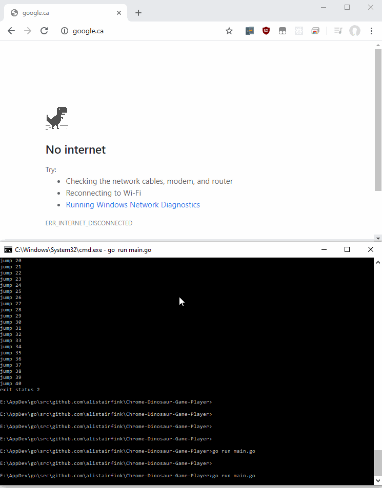

# Chrome Dinosaur Game Automation
Automatically plays the chrome dinosaur game. Clearly this quarantine is revealing I have too much time on my hands.

## How does it work?
To initialize, it asks the user to click the dinosaur's eye. The program will then use this absolute point on the screen to take screenshots (in memory) of a small square of the screen to analyze the pixels ahead of the dinosaur.

  

